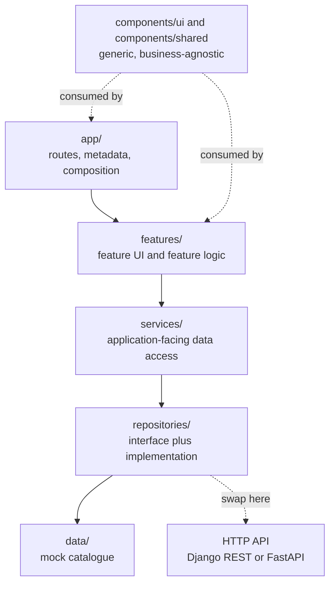

<div align="center">

# Aurelia

**A premium gift &amp; ornament storefront**

Gifts, ornaments, personalized keepsakes, hampers and home decor —
a boutique ecommerce experience built to feel considered rather than transactional.

[](https://nextjs.org)
[](https://react.dev)
[](https://www.typescriptlang.org)
[](https://tailwindcss.com)
[](#status-and-scope)

</div>

---

## Overview

Aurelia is a **frontend-only ecommerce prototype**. The data is prototype-level;
the architecture, component design, accessibility and performance work are
production-level.

Every route, interaction and piece of state is real — filtering, cart,
wishlist, personalization, checkout. Only the *data source* is mocked, and it
sits behind a repository interface so a backend can replace it without a single
UI component changing.

The store is built around two jobs:

1. **Find a specific product** — search, filters, sorting, collections
2. **Find a gift when you have no idea what to buy** — the gift finder

### Contents

- [Highlights](#highlights)
- [Tech stack](#tech-stack)
- [Quick start](#quick-start)
- [Routes](#routes)
- [Architecture](#architecture)
- [Connecting a real backend](#connecting-a-real-backend)
- [Quality gates](#quality-gates)
- [Status and scope](#status-and-scope)

---

## Highlights

Nothing in this build is a decorative stub — every control does the thing it says.

### Discovery

- **URL-driven catalogue** — filters, sorting and search live entirely in
  search params, so every view is shareable, refresh-safe and server-rendered
- **Faceted filtering** by category, occasion, recipient, colour, price band
  and availability, with counts that react to the *other* active filters
- **Search overlay** with live autocomplete over a compact client-side index
- **Gift finder** — pick a recipient, occasion and budget and get scored
  recommendations that explain *why* each one was chosen
- Mega menu, mobile drawer navigation and a thumb-reachable bottom bar

### Product

- Thumbnail gallery with full keyboard navigation
- Size variants and finish swatches that reprice the line
- **Personalization** with a live engraving preview and validation
- Details / delivery / reviews / FAQ tabs, rating distribution, related products

### Commerce

- Cart drawer and full cart page sharing one set of totals
- Wishlist with move-to-bag, persisted per browser and **synced across tabs**
- Gift wrapping, promo codes, free-delivery progress meter
- Five-step checkout with validation, then a real order confirmation you can
  refresh and share by reference

### Craft

- Server Components throughout; interactivity isolated into small client islands
- Empty, loading and error states designed to match the rest of the store
- Accessible by default — landmarks, focus management, live regions, reduced motion
- SEO: per-route metadata, product structured data, generated sitemap and robots

**Catalogue:** 30 products across 8 categories, 9 occasions, 7 recipient edits,
5 collections and 24 reviews.

---

## Tech stack

| Layer | Choice | Why |
| --- | --- | --- |
| Framework | Next.js 16, App Router | Server Components by default |
| UI | React 19 | Client islands only where interaction requires them |
| Language | TypeScript, `strict` + `noUncheckedIndexedAccess` | No `any` in the codebase |
| Styling | Tailwind CSS v4 | Design tokens via `@theme`, no arbitrary hex values |
| Icons | lucide-react | Tree-shaken through `optimizePackageImports` |
| State | React Context + `useSyncExternalStore` | No Redux, no state library |

Only three runtime dependencies beyond the framework: `lucide-react`, `clsx`
and `tailwind-merge`.

---

## Quick start

```bash
git clone https://github.com/RafiAwes/E_commerce.git
cd E_commerce/frontend
npm install
npm run dev
```

Open <http://localhost:3000>.

| Script | What it does |
| --- | --- |
| `npm run dev` | Development server (Turbopack) |
| `npm run build` | Production build |
| `npm run start` | Serve the production build |
| `npm run lint` | ESLint, including the React Compiler rules |
| `npm run typecheck` | `tsc --noEmit` |
| `npm run placeholders` | Regenerate the placeholder artwork |

> Copy `.env.example` to `.env.local` if you want metadata and the sitemap to
> use a non-default origin.

---

## Routes

| Route | Rendering | Notes |
| --- | --- | --- |
| `/` | Static | Homepage — hero through newsletter |
| `/shop` | Dynamic | URL-driven filtering, sorting and search |
| `/products/[slug]` | SSG · 30 pages | Gallery, options, personalization, tabs, reviews |
| `/collections` | Static | Collection index |
| `/collections/[slug]` | SSG · 5 pages | Hero, featured edit, full grid, related |
| `/occasions` | Static | Occasion index |
| `/occasions/[slug]` | Dynamic | Full catalogue architecture, occasion locked in |
| `/wishlist` | Static shell | Saved items resolved client-side |
| `/cart` | Static shell | Bag, gift wrapping, promo code, totals |
| `/checkout` | Static shell | Contact, address, delivery, payment, gift options |
| `/checkout/success` | Dynamic | Order confirmation, read back by reference |
| `/sitemap.xml` · `/robots.txt` | Static | Generated from the catalogue |

Plus `not-found`, `error` and per-route `loading` skeletons.

---

## Architecture

Dependencies flow in one direction. Generic UI never reaches into business code.



### Repository layout

```
.
├── frontend/            Next.js storefront — the application
│   ├── src/
│   │   ├── app/         routes only: composition, metadata, data fetching
│   │   ├── components/  ui · shared · layout · home
│   │   ├── features/    catalog · product · cart · wishlist · gift-finder · checkout
│   │   ├── services/    application-facing data access
│   │   ├── repositories/interfaces + mock implementations
│   │   ├── providers/   cart · wishlist · search · toasts
│   │   ├── lib/         utils, formatters, validations, catalogue algorithms
│   │   ├── data/        the mock catalogue
│   │   └── types/       the domain model
│   └── README.md        full developer documentation
└── .gitignore
```

Each feature owns its own `components/`, `lib/`, `types.ts` and `index.ts`, so
business logic lives in pure functions outside JSX and can be tested on its own.

> **Detailed documentation** — layering rules, the domain model, the design
> system, accessibility notes and the migration guide — lives in
> **[`frontend/README.md`](frontend/README.md)**.

---

## Connecting a real backend

The prototype is structured for a Django REST Framework or FastAPI backend
exposing `GET /products`, `GET /products/:slug`, `GET /collections`,
`GET /occasions`, `GET /categories`, `GET /search`, `POST /newsletter` and
`POST /orders`.

```ts
// src/repositories/index.ts — the composition root, and the only file
// in the codebase that names a concrete repository.
export const productRepository: ProductRepository = new MockProductRepository();
//                                                  ^ swap for ApiProductRepository
```

1. Write `ApiProductRepository implements ProductRepository` (and the catalog,
   collection and order equivalents) that fetch and map responses into the
   domain types in `src/types/common.ts`.
2. Point `src/repositories/index.ts` at the new classes.

That is the whole migration. Services, features, pages and every UI component
keep working unchanged, because they were written against the interfaces and
the domain model rather than the data source.

---

## Quality gates

```bash
npm run typecheck   # strict, plus noUncheckedIndexedAccess
npm run lint        # eslint-config-next + React Compiler rules
npm run build       # type-checks again and pre-renders every product page
```

All three pass clean. No `any`, no `@ts-ignore`, no `console` calls outside the
error boundary, no unused eslint-disable directives.

The layering rules are verifiable rather than aspirational — each of these
returns nothing:

```bash
grep -rn "@/features\|@/services\|@/repositories\|@/data" src/components/ui/
grep -rn "@/repositories\|@/data" src/features/ src/app/
grep -rn "@/features\|@/components" src/repositories/ src/services/
```

---

## Status and scope

This is a **frontend prototype**. By design there is no real payment,
authentication, account system, database, inventory sync or email delivery.
Orders are simulated and stored in the browser; promo codes are simulated.

Everything a backend would own sits behind a service so it can be *implemented*
rather than retrofitted.

**Imagery** — `public/images` ships art-directed SVG plates generated by
`scripts/generate-placeholders.mjs`, so the store is self-contained and visually
cohesive on a fresh clone. Product image paths are centralised in
`src/data/products.ts`; no component hardcodes an image URL, so replacing them
with real photography is a data-only change.
